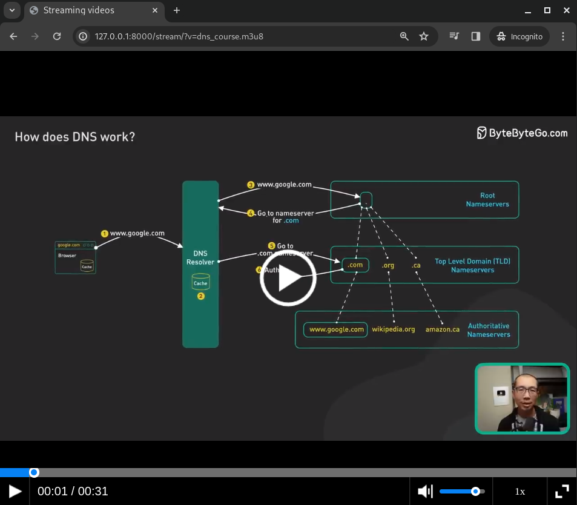

# esiCDN - a CDN architecture for Algerian universities

## Overview
esiCDN is a customized Content Delivery Network designed to meet the specific needs of Algerian students. This CDN aims to accelerate the distribution of educational content, providing students with faster loading times and increased availability. The system comprises three main components: GeoDNS, cache servers, and an origin server.

## Architecture Diagram

## Components

### 1. GeoDNS
GeoDNS is responsible for resolving a domain name to the IP address of the cache server closest to the client's geographical location. The system utilizes [BIND 9](https://github.com/isc-projects/bind9) dns software, which employs geographic proximity determination techniques based on customer IP addresses. This ensures that students can access educational content from the nearest cache server, optimizing their experience.

### 2. Cache Servers
Caching plays a crucial role in the CDN architecture, and [Varnish](https://www.varnish-software.com/) is employed as the caching solution. The cache servers intercept HTTP requests, process them according to user-defined configurations, and return a cached response. If the requested content is not cached, the servers forward the request to the upstream web server. The response is then cached and returned to the client. The cache servers are distributed across Algeria, allowing students to access educational content from the nearest server.

### 3. Origin Server
The origin server hosts the web platform that stores educational content in various formats, including PDFs, images, and videos.  Importantly, the origin server is not directly accessible by visitors; it is only accessed from cache servers, enhancing security and content control.

The videos are served through streaming, allowing cache servers to efficiently store content segments.

## Project Team
The Algerian Student CDN was realized with the collaborative efforts of:

- Khaled Fouad MEDDAH
- Zakaria HEBBAL
- Mouad ELHAOUARI
- Samia AMEUR
- Mohamed Amine BENTAYEB
- Mohamed Amokrane ABDELMALEK (myself)
